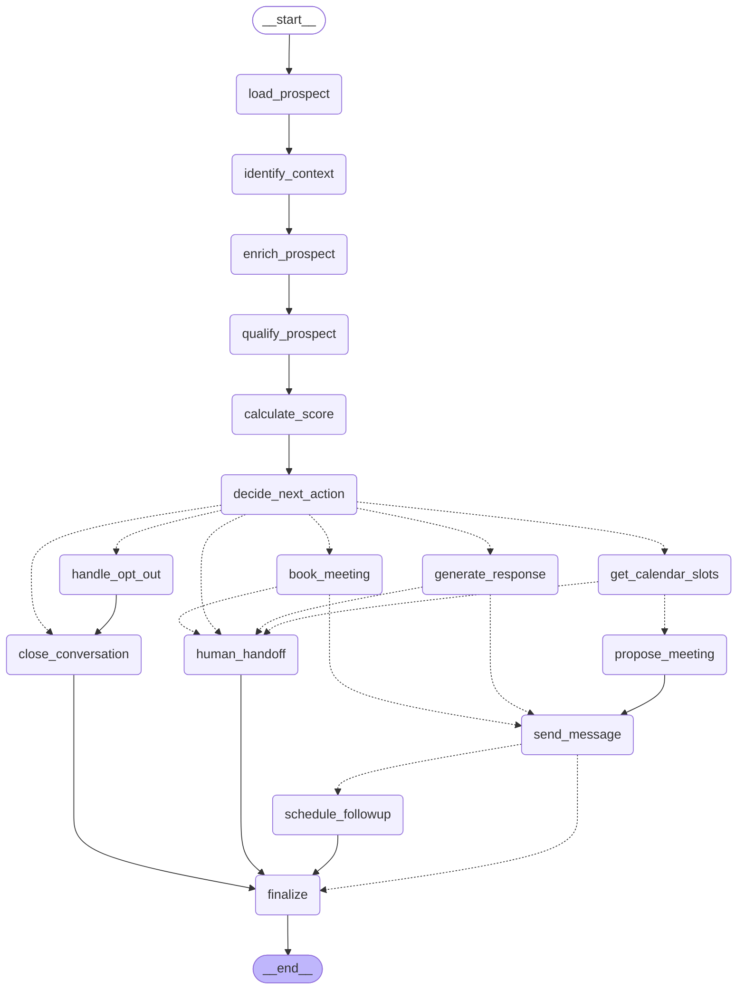

# Workflow agentique (LangGraph)

Le workflow transforme un signal d'intérêt en parcours structuré (CdC §6.1, §9.3) :
**signal → identification → enrichissement → qualification → scoring → décision → action**.
Le modèle de langage *lit* le message et *rédige* ; ce sont des règles de code qui *décident*.

## Graphe (généré depuis le code)

Les flèches pointillées sont des routages conditionnels.



## Qui décide quoi

| Étape | Qui | Détail |
|---|---|---|
| Lire le message (intention, sentiment, infos de profil) | Modèle de langage, sortie structurée | `Qualification` (`app/graph/state.py`) |
| Détecter une demande d'arrêt ou un cas sensible | **Mots-clés, sans modèle** | Filet de sécurité indépendant du modèle (S-03) |
| Calculer le score | Règles | Signaux → points (`app/services/scoring.py`) |
| **Choisir la prochaine action** | **Règles** | `app/graph/policy.py::decide`, chaque décision porte sa justification (OB-05) |
| Changer l'étape | Règles | Jamais en arrière, toujours justifié (`policy.stage_for`) |
| Rédiger la réponse | Modèle de langage | Sur extraits validés uniquement, vérifiée ensuite par le code |
| Proposer des créneaux | Code, message déterministe | Uniquement des créneaux réels de l'agenda |

### Règles de décision (ordre de priorité)

1. **Désinscrit ou demande d'arrêt** → opt-out enregistré, relances annulées, aucun message (scénario 4).
2. **Cas qui exigent un humain, quoi qu'il arrive** : modèle indisponible, situation sensible → transfert (F-20).
3. **Demande de rendez-vous** (même formulée « avec un conseiller ») → l'agent organise le rendez-vous lui-même
   avec des créneaux réels (F-18). Sans agenda, le transfert a lieu juste après : le prospect n'est jamais bloqué.
4. **Demande d'un humain, cas particulier, incertitude** (< 0,5) → transfert.
5. **Pas intéressé** → clôture, aucune relance.
6. **Rendez-vous** : créneau choisi → réservation ; score ≥ 50 avec qualification complète → proposition de créneaux.
7. **Message neutre et score ≤ 24** → entretien espacé (nurturing) et relance programmée (scénario 1).
8. Sinon → poursuite de l'échange et qualification.

**Relances** : toute réponse du prospect, tout transfert à un humain et toute clôture annulent les relances en attente (F-16).

**Questions** : une question précise sans extrait de la base de connaissances est transférée (jamais devinée). Une
question sur la *liste* des formations (`asks_catalogue`) est répondue grâce à la liste validée des trois programmes
(noms et publics uniquement, aucun chiffre) qui figure dans les consignes du modèle.

Les seuils sont des valeurs de conception (CdC §4.2), regroupées en tête de `policy.py`.

## Garde-fous

| Risque | Parade | Exigence |
|---|---|---|
| Le modèle invente un prix, une durée, une date | Réponse **vérifiée par le code** : tout chiffre doit figurer dans les extraits ou la conversation ; un seul nouvel essai plus strict, sinon transfert | NF-10 |
| Question hors base de connaissances | Transfert au conseiller, jamais de réponse devinée | F-20, NF-10 |
| Disponibilité inventée | Aucun créneau cité s'il ne vient pas de l'agenda ; agenda absent → transfert | NF-10, F-18 |
| Prospect désinscrit | Détection sans modèle ; envoi sortant refusé par le service même si le workflow se trompait | S-03 |
| API du modèle en panne ou quota dépassé | Nouveaux essais avec attente croissante, puis transfert avec résumé sans modèle | NF-05 |
| Données personnelles envoyées au modèle | Prénom et informations de qualification seulement : jamais email, téléphone ni identifiants | S-01 |
| Réponse non traçable | Chaque exécution est journalisée (noeuds, décision, justification, scores) | NF-04, OB-05 |
| Fausse identité | L'agent se présente comme assistant virtuel et ne se fait jamais passer pour un humain | Transparence |

## Changer de fournisseur de modèle de langage

Le graphe ne connaît que l'interface `LanguageModel` (`app/graph/ports.py`). Un fournisseur est un adaptateur.

```bash
# Gemini (par défaut)
LLM_PROVIDER=gemini
LLM_MODEL=gemini-2.5-flash
GEMINI_API_KEY=...        # dans votre .env local, jamais dans Git

# OpenAI : même interface, aucune modification du workflow
pip install langchain-openai
LLM_PROVIDER=openai
LLM_MODEL=<nom du modèle>
OPENAI_API_KEY=...
```

> Les intentions (`question`, `meeting_request`, `needs_advisor`...) sont lues par le modèle, avec des définitions
> précises et des exemples dans `prompts.py`. Un filet de sécurité par mots-clés couvre les cas où il hésite entre « veut un
> rendez-vous » et « veut un conseiller ».

Ajouter un autre fournisseur (Anthropic, Hugging Face...) : écrire une fonction `_build_xxx` dans
`app/integrations/llm/factory.py` et l'inscrire dans `_BUILDERS`. Aucun autre fichier ne change.
Sans clé valide, l'agent ne plante pas : il transfère au conseiller (motif `llm_indisponible`).

## Utilisation

```bash
# 1. Créer un prospect, une conversation et un message entrant (voir /docs), puis :
POST /api/v1/agent/runs   {"conversation_id": "<id>"}      # ou {"prospect_id": 12}
# 2. Consulter la décision et sa trace
GET  /api/v1/agent/runs/{run_id}
GET  /api/v1/prospects/{id}/agent-runs
```

Le message rédigé est **enregistré dans la conversation** (`delivery: not_sent`) mais pas encore expédié sur le canal :
la livraison (email IONOS, Meta, LinkedIn) viendra avec les connecteurs.

## Ce qui reste à brancher

| Port | Implémentation actuelle | Suite prévue |
|---|---|---|
| `KnowledgeBase` | Vide : toute question factuelle est transférée | RAG sur les documents validés par DATUM Academy |
| `Calendar` | « Non configuré » : toute demande de rendez-vous est transférée | Google Calendar et Zoom |
| `Messenger` | Enregistre sans envoyer | Connecteurs email / Meta / LinkedIn |
| Déclenchement | Manuel (`POST /agent/runs`) | Automatique à chaque message reçu (F-06) |
| Relances | Programmées, pas exécutées | Planificateur de relances (F-16) |
